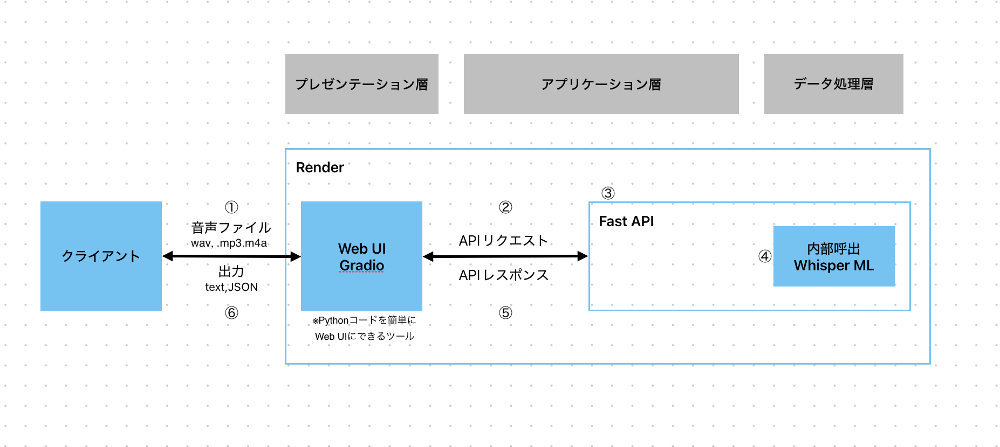

# 音声文字起こしアプリ（Whisper + FastAPI + Gradio）

このプロジェクトは、OpenAIのWhisperモデルを使って音声ファイル（wav, mp3, m4a）を日本語で文字起こしするWebアプリです。GradioによるUIを通じて音声ファイルをアップロードし、FastAPIを経由して文字起こし結果を取得できます。

---

## 🏗 システム構成（3層アーキテクチャ）

  
※Gradio：Pythonコードを簡単にWeb UI化できるツール

- **プレゼンテーション層**（Gradio）  
  音声ファイルのアップロード、結果の表示

- **アプリケーション層**（FastAPI）  
  リクエストの受け取りと処理の制御

- **データ処理層**（Whisper）  
  音声 → テキストへの変換処理

---

## 🚀 起動方法

### 1. 仮想環境を作成（任意）

```bash
python -m venv whisper_env
source whisper_env/bin/activate  # Windows の場合は Scripts\activate
